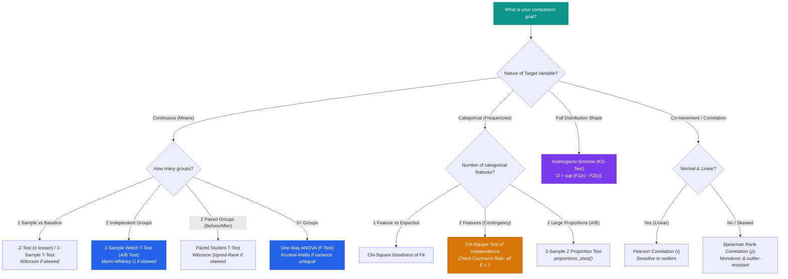

# <p align="center">📊 HypothesisTests — Interactive Statistical Mastery & Revision Dashboard</p>

<p align="center">
  <strong>A zero-jargon, visual & interactive revision platform for Hypothesis Testing, Central Limit Theorem, A/B Testing, ANOVA, Assumption Diagnostics, and Feature Engineering.</strong>
</p>

<p align="center">
  <a href="https://hazardous9hub.github.io/Hypothesis-Tests/"></a>
  
  
  
  
</p>

<p align="center">
  <!-- Dynamic Tech Stack Animated Icons -->
  <a href="https://skillicons.dev">
    
  </a>
</p>

<p align="center">
  
</p>

---

> ### 💡 Author's Note & Attribution
> This repository represents my personal learnings, lecture notes, and structured synthesis of **Hypothesis Testing, Statistical Diagnostics, and Feature Engineering** taught during the **DAV Fundamentals (Scaler DSML)** curriculum and lecture series by instructor Deekshant K.
>
> **Note on Web Engineering:** I did not manually write or design the website code. The entire interactive single-page application, animated Canvas simulations, Baoyu bento layouts, responsive design, and GitHub deployment were engineered with the help of **Google DeepMind Antigravity**. My primary contribution was learning the statistical foundations, analyzing real enterprise case studies (Yulu, Walmart, Aerofit), framing the diagnostic questions, and structuring this zero-jargon interactive revision companion for fellow learners! 🎓

---

## 🚀 Overview

**HypothesisTests** is a high-performance, single-page interactive data analytics revision platform designed for students, data scientists, and machine learning engineers. Built on the core concepts of the **DAV Fundamentals (Scaler DSML)** curriculum and live Colab lecture demonstrations, it replaces dry formulas with live interactive Canvas sliders, error-tradeoff simulators, and real enterprise case studies.

* ⚡ **Lightning Fast:** Only **~28 KB** gzipped payload. Loads in `< 50ms`.
* 🛡️ **100% Private & Safe:** Pure client-side calculations in browser memory. Zero external trackers, zero cookies, zero data exfiltration.
* 🌐 **Zero Server Lag:** Fully static architecture hosted on GitHub Pages with global Anycast CDN edge caching — can serve millions of concurrent learners without slowdowns.
* 📱 **Mobile & Desktop Responsive:** Auto-scaling Canvas charts, touch-friendly controls, and native Dark/Light theme toggles.

---

## 🛠️ Tech Stack & Statistical Ecosystem

<div align="center">

| Ecosystem | Technology | Role & Application | Animated / Visual Badge |
| :--- | :--- | :--- | :--- |
| **AI Pair Programmer** | **Google Antigravity** | Web application architecture, Canvas widgets & deployment |  |
| **Language** | **Python** | Analytical recipes, hypothesis tests & EDA scripting |  |
| **Array Math** | **NumPy** | Vectorized simulations, sampling distributions & CLT |  |
| **DataFrames** | **Pandas** | Contingency cross-tabulation & DataFrame manipulation |  |
| **Statistics** | **SciPy Stats** | Parametric, non-parametric, & distribution diagnostics |  |
| **Econometrics** | **Statsmodels** | Two-sample proportion tests & ANOVA OLS models |  |
| **Two-Way ANOVA**| **Pingouin** | Partial Eta-Squared ($\eta_p^2$) & SS Type-2 variance tables |  |
| **Rendering** | **HTML5 Canvas** | High-DPI hardware-accelerated interactive plotting |  |
| **Frontend** | **JavaScript ES6+**| Real-time p-value, quantile, and statistical math engines |  |
| **Styles** | **CSS3 Modern** | Baoyu Bento Grid UI, Dark/Light theme, responsive layout |  |
| **Deployment** | **GitHub Pages** | Fastly Anycast Global Edge CDN static delivery |  |

</div>

---

## 🗺️ Master Statistical Decision Tree



---

## 📦 What's Inside? (16 Interactive Modules)

<details open>
<summary><strong>Click to expand the complete feature tour</strong></summary>

1. **Pick the Test (Interactive Wizard):** Multi-step decision wizard mapping continuous/categorical inputs, sample sizes, and normality constraints to the exact test and rationale.
2. **Case Studies Hub:** Ready-to-use analysis architectures for **Yulu Bike Sharing** (10,886 rows), **Walmart Black Friday Spend** (550,000 rows), and **Aerofit Treadmills** (KP281, KP481, KP781).
3. **1. Basics & Statistical Power:** Live $\alpha$, $\beta$, and Statistical Power ($1 - \beta$) tradeoff canvas.
4. **2. Central Limit Theorem & CI Overlap:** 
   - Interactive CLT Simulator with Exponential, Uniform, and Bimodal population transformations.
   - **The 95% CI Overlap Fallacy Sandbox:** Visual proof that overlapping 95% confidence intervals can still yield $p < 0.05$ because $\text{SE}_{\text{diff}} \le \text{SE}_1 + \text{SE}_2$.
5. **3. Z-Test & Proportions:** Firm A vs Firm B store sales simulator with dynamic rejection tails and two-sample proportion tests.
6. **4. T-Test & Cohorts:** Degrees of freedom ($df$) morph visualizer showing Student's fat tails merging into Gaussian normal $Z$.
7. **5. Industry A/B Testing & Sample Sizing:** YouTube watch-time case study, Minimum Detectable Effect (MDE), sample size calculator, and the 3 deadly traps (Peeking, SRM, Novelty).
8. **6. Chi-Square ($\chi^2$) & Cochran's Rule:** Editable $2 \times 2$ contingency matrix with live expected values and the Yulu Weather=4 anomaly case study.
9. **7. ANOVA & Two-Way Interaction:** Pingouin $F$-statistic partitioning and a live interaction plot showing parallel vs crossing lines.
10. **8. Diagnostics & Kruskal-Wallis:** Q-Q plot shape explorer, Shapiro-Wilk normality, and Levene's test of equal variance.
11. **9. KS-Test & Empirical CDFs:** Kolmogorov-Smirnov $D$-statistic explorer tracking the maximum vertical divergence between patient recovery times.
12. **10. Correlation & Heatmaps:** Interactive scatter plot with an outlier attack switch comparing Pearson collapse vs Spearman resilience.
13. **11. Feature Engineering 1 (Imputation & Outliers):** Skewness slider, $\log(1+x)$ normalizer, and SimpleImputer strategies.
14. **12. Feature Engineering 2 (Encodings & Scalers):** Target Encoding with additive smoothing sandbox ($m$-weight) and Scaler outlier benchmark.
15. **13. Classroom Problem Solving Arena:** 6 real-world exam/interview scenarios from lecture problem sets with instant diagnostic feedback and Python recipes.
16. **14. Scaler Viva & Interview Gotchas:** Top 10 gotchas (Never say "Accept $H_0$", Data leakage, Dummy variable trap, Large sample $p$-value paradox, etc.).

</details>

---

## 💼 Real-World Case Studies Included

```
📁 Case Studies
├── 🚲 Yulu Bikes (10,886 rows)
│   ├── Working Day vs Non-Working Day (Welch's T-Test: Fail to reject H0, p ≈ 0.226)
│   ├── Seasonal Demand Fluctuations (One-Way ANOVA & Tukey HSD: p < 1e-100)
│   ├── Weather Vulnerability (ANOVA: Bad weather cuts demand by ~42%)
│   └── Weather vs Season Independence (Chi-Square: Handled single Weather=4 row)
│
├── 🛒 Walmart Customer Spend (550,000 rows)
│   ├── Gender Spend Disparity (T-Test: Men buy high-ticket electronics, women buy lifestyle)
│   ├── Central Limit Theorem Convergence (n=10, 50, 100, 1000 sampling distribution)
│   ├── 95% Confidence Interval Overlap Analysis (Non-overlapping male/female CIs)
│   └── Life Stage Spend (One-Way ANOVA across 7 age categories: 51-55 peak spenders)
│
└── 🏃 Aerofit Treadmill Profiling
    └── KP281 ($1,500) vs KP481 ($2,500) vs KP781 ($3,500) customer income ANOVA
```

---

## 🔒 Security, Privacy & Performance Audit

* **Content-Security-Policy (CSP):** Strict CSP headers prevent cross-site scripting and unauthorized script loading.
* **Permissions-Policy:** Device access (camera, microphone, geolocation, payment, sensors) is strictly disabled.
* **Offline Operation:** The entire application runs directly from your local file system (`file://`) without internet access or active servers.
* **Zero Third-Party Callouts:** No external JavaScript libraries, analytics beacons, or remote font dependencies.

---

## 💻 How to Run Locally

You don't need Node.js, Python servers, or build tools. Simply:

1. Clone or download this repository:
   ```bash
   git clone https://github.com/Hazardous9hub/Hypothesis-Tests.git
   ```
2. Double-click **`index.html`** (or **`hypothesistests.html`**) to open it in any modern browser (Chrome, Edge, Firefox, Safari).

---

## 📜 License & Credits

Distributed under the **MIT License**.  
* **Curriculum & Statistical Learnings:** Scaler DSML (DAV Fundamentals) • Instructor Deekshant K.  
* **Conceptualization & Student Synthesis:** [Hazardous9hub](https://github.com/Hazardous9hub)  
* **Interactive Web Platform & Engineering:** Built with the assistance of **Google DeepMind Antigravity**.
